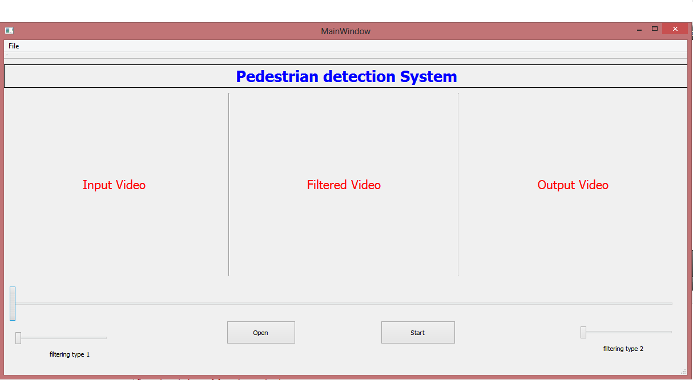
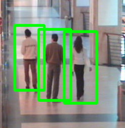
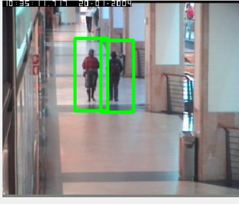

# Pedestrian Detection System

## Description
This project, implemented with C++, OpenCV, and Qt, is an image processing and machine learning system designed to identify pedestrians among other moving objects in real-time video streams and images. It utilizes Histogram of Oriented Gradients (HOG) descriptors, adaptive filtering, and support vector machine (SVM) classifiers, with a specific focus on head and shoulder information for precise detection. The method has been tested on a standard dataset and results have been analyzed using a 10-part cross-validation method.

The project is composed of the following components:
- `Main.cpp`: The main program file that sets up the video processing and frame analysis.
- `PeopleDetector.h`: A header file defining the `PeopleDetector` class responsible for implementing the pedestrian detection algorithm.
- `SVMClassifier.h`: A header file defining the `SVMClassifier` class for training and using an SVM-based classifier.
- `VideoProcessor.h`: A header file defining classes and functions for video processing and frame display.

The code is structured to process video input and apply pedestrian detection, making it a valuable tool for various applications, such as traffic management, surveillance, and autonomous vehicles.

## Screenshots

